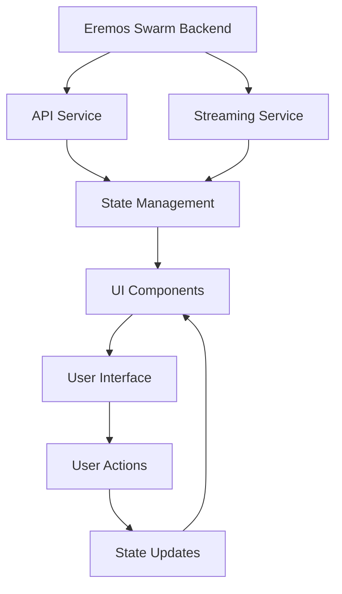

# Eremos Swarm - Real-Time Swarm Viewer (UI) Roadmap

## Project Overview

**Purpose**: Provide a Next.js/TypeScript dashboard for visualizing agent signals, wallet activity, and swarm interactions in real time.

**Vision**: Transform the Eremos Swarm from a backend monitoring system into a comprehensive real-time visualization platform that enables developers, traders, and security analysts to interact with blockchain intelligence through an intuitive, responsive interface.

---

## Phase 1: Foundation & Core Infrastructure

### 1.1 Project Setup & Architecture

**Objectives:**
- Establish Next.js 14+ project with TypeScript
- Set up development environment and build pipeline
- Create responsive design system
- Implement authentication and security

**Deliverables:**
```bash
# Project structure
eremos-swarm-ui/
├── src/
│   ├── app/                    # Next.js App Router
│   ├── components/             # Reusable UI components
│   ├── hooks/                  # Custom React hooks
│   ├── lib/                    # Utilities and configurations
│   ├── services/               # API and streaming services
│   ├── stores/                 # State management
│   ├── types/                  # TypeScript definitions
│   └── utils/                  # Helper functions
├── public/                     # Static assets
├── docs/                       # UI-specific documentation
└── tests/                      # Testing suite
```

**Technical Stack:**
- **Framework**: Next.js 14+ with App Router
- **Language**: TypeScript 5.0+
- **Styling**: Tailwind CSS + shadcn/ui
- **State Management**: Zustand + React Query
- **Charts**: Chart.js + react-chartjs-2
- **Real-time**: Server-Sent Events (SSE) + WebSocket fallback
- **Testing**: Jest + React Testing Library
- **Deployment**: Vercel + Docker

### 1.2 Design System & UI Components

**Core Components:**
```typescript
// Component hierarchy
components/
├── ui/                         # Base UI components (shadcn/ui)
│   ├── button.tsx
│   ├── card.tsx
│   ├── badge.tsx
│   └── ...
├── layout/                     # Layout components
│   ├── Header.tsx
│   ├── Sidebar.tsx
│   ├── Footer.tsx
│   └── DashboardLayout.tsx
├── charts/                     # Chart components
│   ├── SignalTimeline.tsx
│   ├── AgentActivityHeatmap.tsx
│   ├── PerformanceMetrics.tsx
│   └── WalletClusterMap.tsx
├── agents/                     # Agent-specific components
│   ├── AgentCard.tsx
│   ├── AgentStatus.tsx
│   ├── SignalFeed.tsx
│   └── AgentMetrics.tsx
└── common/                     # Shared components
    ├── LoadingSpinner.tsx
    ├── ErrorBoundary.tsx
    ├── ConfirmationDialog.tsx
    └── ...
```

**Design Tokens:**
```typescript
// Tailwind configuration with Eremos theme
const eremosTheme = {
  colors: {
    primary: {
      50: '#f0f9ff',
      500: '#3b82f6',
      900: '#1e3a8a'
    },
    agent: {
      theron: '#8b5cf6',      // Purple for memory
      observer: '#06b6d4',    // Cyan for surveillance
      harvester: '#10b981',   // Green for indexing
      launchTracker: '#f59e0b', // Amber for launches
      liquidity: '#ef4444',   // Red for DeFi
      scamSentinel: '#dc2626', // Dark red for fraud
      feeAnalyzer: '#84cc16', // Lime for optimization
      zkpAgent: '#6366f1'     // Indigo for privacy
    }
  }
}
```

### 1.3 API Integration Layer

**Services Architecture:**
```typescript
// services/api.ts
export class EremosAPIService {
  private baseURL: string;
  private apiKey?: string;

  constructor(baseURL: string, apiKey?: string) {
    this.baseURL = baseURL;
    this.apiKey = apiKey;
  }

  // Signal Registry
  async getSignalRegistry(): Promise<SignalRegistryResponse>
  async getSignalMetadata(type: string): Promise<SignalMetadata>
  async getAgentGlyphs(): Promise<AgentGlyph[]>

  // Agent Memory
  async getAgentMemory(agentId: string, filters?: MemoryFilters): Promise<AgentMemoryResponse>
  async getAgentSnapshot(agentId: string): Promise<AgentSnapshot>
  async searchMemory(query: MemorySearchQuery): Promise<MemorySearchResponse>

  // Performance Metrics
  async getSystemMetrics(): Promise<SystemMetrics>
  async getAgentMetrics(agentName: string): Promise<AgentMetrics>
  async getMetricsSummary(): Promise<MetricsSummary>
}

// services/streaming.ts
export class EremosStreamingService {
  private eventSource: EventSource | null = null;
  private reconnectAttempts = 0;
  private maxReconnectAttempts = 5;

  // Signal Streaming
  connectToSignalStream(filters?: SignalStreamFilter): Promise<void>
  connectToMetricsStream(): Promise<void>
  disconnect(): void

  // Event handlers
  onSignalEmission(callback: (signal: StreamedSignal) => void): void
  onMetricsUpdate(callback: (metrics: SystemMetrics) => void): void
  onError(callback: (error: Error) => void): void
}
```

---

## Phase 2: Core Dashboard Features 

### 2.1 Real-Time Signal Visualization

**Signal Timeline Component:**
```typescript
// components/charts/SignalTimeline.tsx
interface SignalTimelineProps {
  signals: StreamedSignal[];
  filters: {
    agentName?: string;
    signalType?: string;
    minConfidence?: number;
    timeRange?: TimeRange;
  };
  onSignalClick: (signal: StreamedSignal) => void;
}

export const SignalTimeline: React.FC<SignalTimelineProps> = ({
  signals,
  filters,
  onSignalClick
}) => {
  // Implementation with Chart.js timeline
  // Real-time updates via streaming
  // Interactive signal points
  // Filter controls
  // Confidence score visualization
}
```

**Features:**
- **Real-time Updates**: Live signal feed with configurable refresh rates
- **Interactive Timeline**: Clickable signal points with detailed tooltips
- **Filter Controls**: Agent, signal type, confidence, and time range filters
- **Signal Details**: Expandable signal information with transaction links
- **Export Capabilities**: PNG, SVG, and CSV export options

### 2.2 Agent Activity Dashboard

**Agent Overview Component:**
```typescript
// components/agents/AgentOverview.tsx
interface AgentOverviewProps {
  agents: AgentMetrics[];
  onAgentSelect: (agentId: string) => void;
}

export const AgentOverview: React.FC<AgentOverviewProps> = ({
  agents,
  onAgentSelect
}) => {
  // Agent status cards with real-time metrics
  // Performance indicators (success rate, processing time)
  // Signal emission frequency
  // Error rate monitoring
  // Uptime tracking
}
```

**Agent Detail View:**
```typescript
// components/agents/AgentDetail.tsx
interface AgentDetailProps {
  agentId: string;
  metrics: AgentMetrics;
  recentSignals: StreamedSignal[];
  memoryData: AgentMemoryData;
}

export const AgentDetail: React.FC<AgentDetailProps> = ({
  agentId,
  metrics,
  recentSignals,
  memoryData
}) => {
  // Detailed agent performance metrics
  // Signal history and patterns
  // Memory logs and state information
  // Configuration settings
  // Historical performance trends
}
```

### 2.3 Performance Metrics Visualization

**System Health Dashboard:**
```typescript
// components/charts/SystemHealth.tsx
interface SystemHealthProps {
  metrics: SystemMetrics;
  historicalData: MetricsSnapshot[];
}

export const SystemHealth: React.FC<SystemHealthProps> = ({
  metrics,
  historicalData
}) => {
  // System-wide performance overview
  // Agent comparison charts
  // Resource utilization monitoring
  // Alert thresholds and notifications
  // Performance trend analysis
}
```

**Metrics Components:**
- **Performance Charts**: Line charts for processing times, success rates
- **Agent Comparison**: Bar charts comparing agent performance
- **Resource Monitoring**: CPU, memory, and network usage
- **Alert System**: Visual indicators for performance issues
- **Historical Analysis**: Trend analysis and forecasting

---

## Phase 3: Advanced Visualizations

### 3.1 Wallet Activity Heatmap

**Wallet Cluster Visualization:**
```typescript
// components/charts/WalletClusterHeatmap.tsx
interface WalletClusterHeatmapProps {
  walletData: WalletActivityData[];
  timeRange: TimeRange;
  clusterThreshold: number;
}

export const WalletClusterHeatmap: React.FC<WalletClusterHeatmapProps> = ({
  walletData,
  timeRange,
  clusterThreshold
}) => {
  // Interactive heatmap showing wallet activity density
  // Cluster detection and visualization
  // Time-based activity patterns
  // Suspicious activity highlighting
  // Drill-down capabilities for cluster details
}
```

**Features:**
- **Activity Density**: Color-coded heatmap showing transaction density
- **Cluster Detection**: Automatic identification of wallet clusters
- **Time Patterns**: 24-hour and weekly activity patterns
- **Suspicious Activity**: Highlighting of unusual patterns
- **Interactive Exploration**: Click to explore cluster details

### 3.2 Network Graph Visualization

**Agent Interaction Network:**
```typescript
// components/charts/AgentNetworkGraph.tsx
interface AgentNetworkGraphProps {
  agents: AgentMetrics[];
  interactions: AgentInteraction[];
  signalCorrelations: SignalCorrelation[];
}

export const AgentNetworkGraph: React.FC<AgentNetworkGraphProps> = ({
  agents,
  interactions,
  signalCorrelations
}) => {
  // Force-directed graph showing agent relationships
  // Signal correlation visualization
  // Interactive node exploration
  // Network analysis metrics
  // Export capabilities
}
```

**Network Analysis Features:**
- **Force-Directed Layout**: Dynamic positioning based on relationships
- **Node Sizing**: Agent size based on activity level
- **Edge Weighting**: Connection strength based on signal correlation
- **Community Detection**: Automatic cluster identification
- **Path Analysis**: Shortest paths between agents

### 3.3 Advanced Analytics Dashboard

**Signal Pattern Analysis:**
```typescript
// components/analytics/SignalPatternAnalysis.tsx
interface SignalPatternAnalysisProps {
  signals: StreamedSignal[];
  timeRange: TimeRange;
  analysisType: 'frequency' | 'correlation' | 'anomaly';
}

export const SignalPatternAnalysis: React.FC<SignalPatternAnalysisProps> = ({
  signals,
  timeRange,
  analysisType
}) => {
  // Frequency analysis of signal types
  // Correlation analysis between agents
  // Anomaly detection and highlighting
  // Predictive analytics
  // Pattern recognition algorithms
}
```

**Analytics Features:**
- **Frequency Analysis**: Signal emission patterns over time
- **Correlation Matrix**: Agent-to-agent signal correlations
- **Anomaly Detection**: Statistical outlier identification
- **Predictive Models**: Machine learning-based forecasting
- **Custom Queries**: Advanced filtering and analysis

---

## Phase 4: Interactive Features & Customization 

### 4.1 Customizable Dashboard Layouts

**Layout Management System:**
```typescript
// components/layout/DashboardBuilder.tsx
interface DashboardBuilderProps {
  layouts: DashboardLayout[];
  onLayoutChange: (layout: DashboardLayout) => void;
}

export const DashboardBuilder: React.FC<DashboardBuilderProps> = ({
  layouts,
  onLayoutChange
}) => {
  // Drag-and-drop layout builder
  // Component library for widgets
  // Layout templates and presets
  // Save and share layouts
  // Responsive design support
}
```

**Layout Features:**
- **Drag-and-Drop Interface**: Intuitive layout building
- **Widget Library**: Pre-built components for common use cases
- **Layout Templates**: Preset configurations for different roles
- **Responsive Design**: Automatic adaptation to screen sizes
- **Layout Persistence**: Save and restore custom layouts

### 4.2 Advanced Filtering & Search

**Advanced Filter System:**
```typescript
// components/filters/AdvancedFilterPanel.tsx
interface AdvancedFilterPanelProps {
  filters: FilterConfiguration;
  onFilterChange: (filters: FilterConfiguration) => void;
}

export const AdvancedFilterPanel: React.FC<AdvancedFilterPanelProps> = ({
  filters,
  onFilterChange
}) => {
  // Multi-dimensional filtering
  // Saved filter presets
  // Filter validation and suggestions
  // Export filter configurations
  // Real-time filter preview
}
```

**Filter Capabilities:**
- **Multi-Agent Filtering**: Select multiple agents simultaneously
- **Signal Type Filtering**: Filter by signal categories and types
- **Confidence Thresholds**: Dynamic confidence-based filtering
- **Time Range Selection**: Flexible time period selection
- **Geographic Filtering**: Location-based filtering (if applicable)

### 4.3 Real-Time Alerts & Notifications

**Alert Management System:**
```typescript
// components/alerts/AlertManager.tsx
interface AlertManagerProps {
  alerts: Alert[];
  onAlertAction: (alertId: string, action: AlertAction) => void;
}

export const AlertManager: React.FC<AlertManagerProps> = ({
  alerts,
  onAlertAction
}) => {
  // Real-time alert display
  // Alert categorization and prioritization
  // Action buttons for alert responses
  // Alert history and statistics
  // Custom alert rules configuration
}
```

**Alert Features:**
- **Real-Time Notifications**: Browser notifications for critical alerts
- **Alert Categories**: Priority-based alert organization
- **Action Buttons**: Quick response actions for alerts
- **Alert History**: Comprehensive alert logging
- **Custom Rules**: User-defined alert conditions

---

## Phase 5: Integration & Advanced Features

### 5.1 External System Integration

**Blockchain Explorer Integration:**
```typescript
// services/integrations/BlockchainExplorer.ts
export class BlockchainExplorerService {
  // Solscan integration for Solana
  // Etherscan integration for Ethereum
  // Multi-chain support
  // Transaction detail fetching
  // Address information retrieval
}
```

**Integration Features:**
- **Transaction Links**: Direct links to blockchain explorers
- **Address Information**: Wallet details and transaction history
- **Multi-Chain Support**: Support for multiple blockchain networks
- **Real-Time Updates**: Live transaction status updates
- **Custom Explorer Support**: Configurable explorer endpoints

### 5.2 Export & Reporting System

**Data Export System:**
```typescript
// services/export/DataExportService.ts
export class DataExportService {
  // CSV export for signal data
  // PDF report generation
  // JSON API responses
  // Scheduled report generation
  // Custom report templates
}
```

**Export Features:**
- **CSV Export**: Signal and metrics data export
- **PDF Reports**: Professional report generation
- **API Access**: RESTful API for external integrations
- **Scheduled Reports**: Automated report generation
- **Custom Templates**: User-defined report formats

### 5.3 Performance Optimization

**Optimization Strategies:**
```typescript
// hooks/useOptimizedStreaming.ts
export const useOptimizedStreaming = (endpoint: string, filters: FilterConfig) => {
  // Intelligent data caching
  // Lazy loading for large datasets
  // Virtual scrolling for long lists
  // Debounced updates for real-time data
  // Memory management for long-running sessions
}
```

**Performance Features:**
- **Data Caching**: Intelligent caching of frequently accessed data
- **Lazy Loading**: Progressive loading of large datasets
- **Virtual Scrolling**: Efficient rendering of long lists
- **Debounced Updates**: Optimized real-time update frequency
- **Memory Management**: Efficient memory usage for long sessions

---

## Phase 6: Testing, Documentation & Deployment

### 6.1 Comprehensive Testing Suite

**Testing Strategy:**
```typescript
// tests/components/SignalTimeline.test.tsx
describe('SignalTimeline', () => {
  it('should render signals correctly', () => {
    // Component rendering tests
  });

  it('should handle real-time updates', () => {
    // Real-time update tests
  });

  it('should apply filters correctly', () => {
    // Filter functionality tests
  });
});

// tests/services/EremosAPIService.test.ts
describe('EremosAPIService', () => {
  it('should fetch signal registry', async () => {
    // API integration tests
  });

  it('should handle streaming connections', async () => {
    // Streaming service tests
  });
});
```

**Testing Coverage:**
- **Unit Tests**: Component and service testing
- **Integration Tests**: API and streaming integration
- **E2E Tests**: Complete user workflow testing
- **Performance Tests**: Load and stress testing
- **Accessibility Tests**: WCAG compliance testing

### 6.2 Documentation & User Guides

**Documentation Structure:**
```markdown
docs/
├── getting-started.md          # Quick start guide
├── user-guide.md              # Comprehensive user manual
├── api-reference.md           # API documentation
├── component-library.md       # Component documentation
├── deployment-guide.md        # Deployment instructions
├── troubleshooting.md         # Common issues and solutions
└── examples/                  # Code examples and tutorials
    ├── custom-dashboard.md
    ├── alert-configuration.md
    └── data-export.md
```

**Documentation Features:**
- **Interactive Examples**: Live code examples
- **Video Tutorials**: Step-by-step video guides
- **API Reference**: Comprehensive API documentation
- **Troubleshooting Guide**: Common issues and solutions
- **Best Practices**: Development and usage guidelines

### 6.3 Deployment & DevOps

**Deployment Pipeline:**
```yaml
# .github/workflows/deploy.yml
name: Deploy Eremos Swarm UI

```

**Deployment Features:**
- **CI/CD Pipeline**: Automated testing and deployment
- **Environment Management**: Development, staging, and production
- **Monitoring**: Application performance monitoring
- **Backup Strategy**: Data backup and recovery
- **Security**: Security scanning and compliance

---

## Technical Specifications

### Architecture Overview

```typescript
// Core application structure
interface EremosSwarmUI {
  // State management
  stores: {
    agents: AgentStore;
    signals: SignalStore;
    metrics: MetricsStore;
    ui: UIStore;
  };

  // Services
  services: {
    api: EremosAPIService;
    streaming: EremosStreamingService;
    export: DataExportService;
    integrations: BlockchainExplorerService;
  };

  // Components
  components: {
    charts: ChartComponents;
    agents: AgentComponents;
    layout: LayoutComponents;
    common: CommonComponents;
  };
}
```

### Data Flow Architecture



### Performance Requirements

**Real-Time Performance:**
- **Signal Updates**: < 100ms latency for new signals
- **Chart Rendering**: < 50ms for chart updates
- **Filter Response**: < 200ms for filter application
- **Page Load**: < 2s initial page load time
- **Memory Usage**: < 500MB for typical usage

**Scalability Targets:**
- **Concurrent Users**: Support 100+ concurrent users
- **Data Volume**: Handle 10,000+ signals per hour
- **Agent Count**: Support 50+ active agents
- **Historical Data**: 30 days of historical data retention

---

## Success Metrics & KPIs

### User Experience Metrics
- **Page Load Time**: Target < 2 seconds
- **Time to Interactive**: Target < 3 seconds
- **User Engagement**: Average session duration > 10 minutes
- **Feature Adoption**: > 80% of users use advanced features
- **User Satisfaction**: > 4.5/5 rating

### Performance Metrics
- **Uptime**: 99.9% availability
- **Error Rate**: < 0.1% error rate
- **API Response Time**: < 200ms average
- **Streaming Latency**: < 100ms for real-time updates
- **Memory Usage**: < 500MB typical usage

### Business Metrics
- **User Growth**: 20% month-over-month growth
- **Feature Usage**: > 60% of users use custom dashboards
- **Export Usage**: > 40% of users export data regularly
- **Integration Adoption**: > 30% of users integrate with external systems

---

## Risk Assessment & Mitigation

### Technical Risks

**Risk**: Real-time streaming performance issues
**Mitigation**: Implement connection pooling, fallback mechanisms, and performance monitoring

**Risk**: Large dataset rendering performance
**Mitigation**: Implement virtual scrolling, data pagination, and lazy loading

**Risk**: Browser compatibility issues
**Mitigation**: Comprehensive cross-browser testing and polyfill implementation

### Security Risks

**Risk**: API key exposure
**Mitigation**: Secure key management, environment variable usage, and API key rotation

**Risk**: Data privacy concerns
**Mitigation**: Data encryption, access controls, and privacy compliance

**Risk**: XSS vulnerabilities
**Mitigation**: Input sanitization, Content Security Policy, and security testing

### Operational Risks

**Risk**: Deployment failures
**Mitigation**: Automated testing, rollback procedures, and monitoring

**Risk**: Data loss
**Mitigation**: Regular backups, data validation, and recovery procedures

**Risk**: User adoption challenges
**Mitigation**: User training, documentation, and feedback collection

---

## Future Enhancements

### Phase 7: Advanced Analytics (Post-Launch)

**Machine Learning Integration:**
- **Predictive Analytics**: Signal pattern prediction
- **Anomaly Detection**: Advanced anomaly identification
- **Recommendation Engine**: Intelligent alert suggestions
- **Natural Language Processing**: Query interface for data exploration

### Phase 8: Mobile & Accessibility

**Mobile Application:**
- **React Native App**: Cross-platform mobile application
- **Offline Support**: Offline data access and synchronization
- **Push Notifications**: Mobile alert notifications
- **Touch Optimization**: Touch-friendly interface design

### Phase 9: Enterprise Features

**Enterprise Capabilities:**
- **Multi-Tenancy**: Support for multiple organizations
- **Role-Based Access**: Granular permission system
- **Audit Logging**: Comprehensive activity logging
- **Custom Integrations**: Enterprise system integrations

---

## Conclusion

The Real-Time Swarm Viewer UI represents a significant evolution of the Eremos Swarm platform, transforming it from a backend monitoring system into a comprehensive, interactive visualization platform. This roadmap provides a structured approach to building a world-class user interface that leverages the full capabilities of the existing Eremos Swarm backend.

The phased approach ensures steady progress while maintaining quality and user experience. Each phase builds upon the previous one, creating a solid foundation for advanced features and future enhancements.

**Key Success Factors:**
1. **Real-time Performance**: Ensuring sub-100ms latency for critical operations
2. **User Experience**: Creating an intuitive, responsive interface
3. **Scalability**: Building for growth and increased usage
4. **Integration**: Seamless connection with existing systems
5. **Quality**: Comprehensive testing and documentation

This roadmap serves as a living document that will be updated as the project progresses, incorporating user feedback, technical discoveries, and evolving requirements.

---

*Last Updated: 2025-01-26*  
*Version: 1.0.0*  